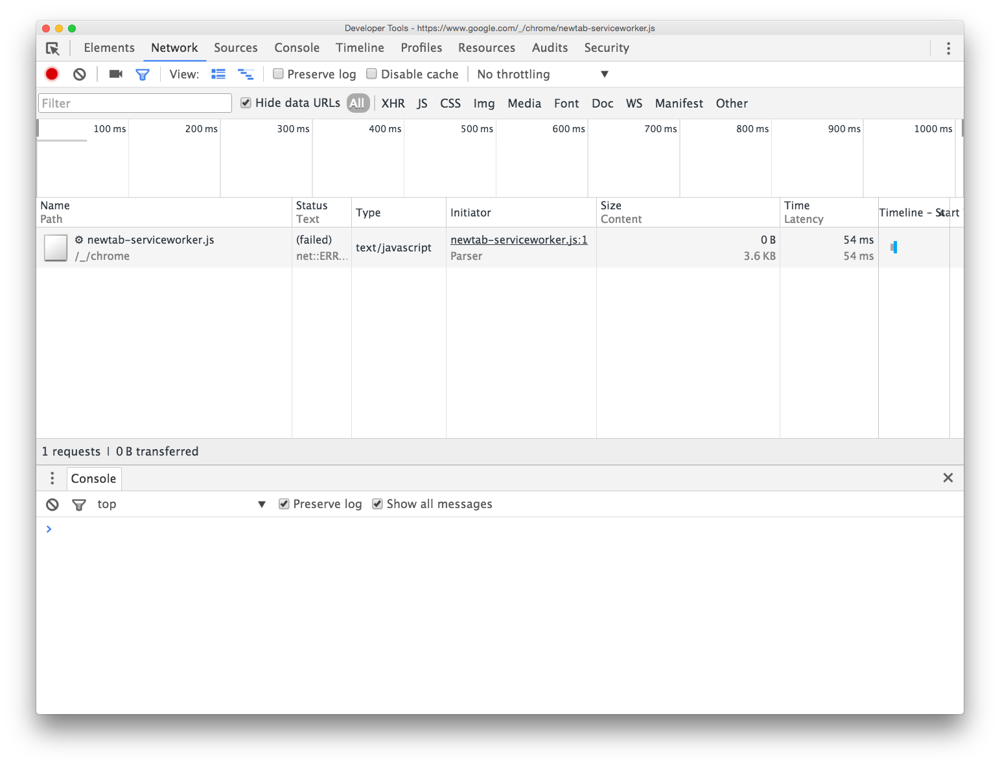
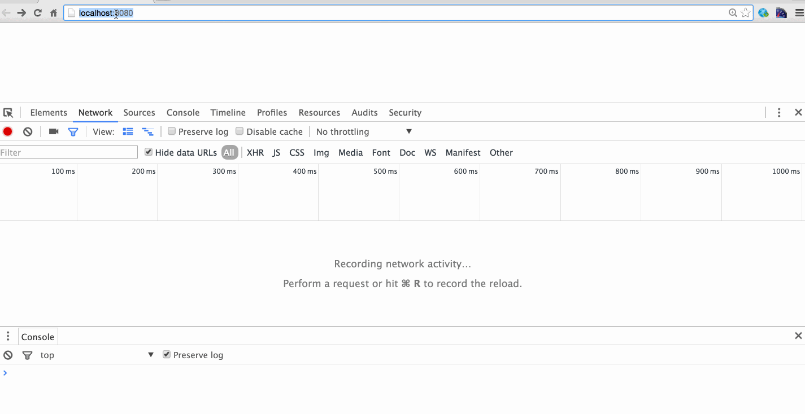

# Cache or not Cache

Author: Lin Dong

Date: Mon Jan 11 16:50:26 PST 2016

## Note
Its good to know the ways of telling the browser whether to cache or not cache files from the server.

## How to run
1. `python server 8080`
2. open `http://localhost:8080` in Chrome
3. Disable cache ChromeDevTools
  
4. `cp index2.html index.html` for testing caching html
5. `cp js/main2.js js/main.js` for testing caching javascript

## Demo

## Gotchas
Chrome has 3 ways of refreshing the page [By Tushar](http://stackoverflow.com/a/16510707/2305243):

1.  Press enter in the address box. You will observe chrome reads the file from the cache first and does not go to the server at all.
2.  Press f5, this would verify if the file has become stale (probably that is how you are refreshing)
3.  Press Ctrl+f5, this is unconditional reload of all static resources.

To try out caching, just press `Enter` in the address bar.

# Reference
1. [Specifing Expiration Date For Static File's Caches in Tomcat](http://stackoverflow.com/questions/5531994/specifing-expiration-date-for-static-files-caches)
2. [Caching Tutorial for Web Authors and Webmasters](https://www.mnot.net/cache_docs/#META)
3. [A Beginner's Guide to HTTP Cache Headers](http://www.mobify.com/blog/beginners-guide-to-http-cache-headers/)
4. [HTTP Cache Specs](https://www.w3.org/Protocols/rfc2616/rfc2616-sec13.html)
5. [Useful HTML Meta Tags](http://www.i18nguy.com/markup/metatags.html)
6. [Cache-Control HTTP Headers](http://condor.depaul.edu/dmumaugh/readings/handouts/SE435/HTTP/node24.html)
7. [Two Simple Rules for HTTP Caching](https://blog.httpwatch.com/2007/12/10/two-simple-rules-for-http-caching/)
8. [How To Optimize Your Site With HTTP Caching](http://betterexplained.com/articles/how-to-optimize-your-site-with-http-caching/)
9. [HTTP caching by Google Developers](https://developers.google.com/web/fundamentals/performance/optimizing-content-efficiency/http-caching?hl=en#cache-control)
10. [Python Server Example from Stackoverflow](http://stackoverflow.com/questions/12193803/invoke-python-simplehttpserver-from-command-line-with-no-cache-option)
11. [Increasing Application Performance with HTTP Cache Headers by Heroku](https://devcenter.heroku.com/articles/increasing-application-performance-with-http-cache-headers#http-cache-headers)
12. [Speed Tips: Add Cache-Control Headers](http://www.askapache.com/htaccess/apache-speed-cache-control.html#Cache-Control_Headers-s0)
